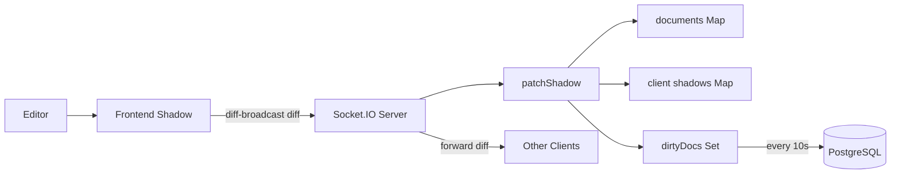

# MultiDoc

MultiDoc is a real-time collaborative document editor.
It uses React on the frontend, Express and Socket.IO on the backend, and PostgreSQL for document storage.

## File Structure

```text
MultiDoc
|- backend
|  |- controller
|  |- db
|  |- middleware
|  |- router
|  |- socket
|- frontend
|  |- src
|  |  |- api
|  |  |- components
|  |  |- context
|  |  |- Shadow
|- docker-compose.yml
```

## Current Working Method

The current update flow uses a patch method.
The frontend compares editor text with its shadow text and sends only the changed part as a diff.
The backend applies that diff to the current document text, updates each connected client shadow, and marks the document dirty for PostgreSQL flush.

### Patch Method Detail

The backend keeps document state in three structures:

```js
const documents = new Map();
// docId -> current document text

const shadows = new Map();
// docId -> socketId -> shadow text

const dirtyDocs = new Set();
// docIds waiting to be flushed to PostgreSQL
```

Each socket gets its own shadow copy when it joins a document.
When a user edits, the frontend sends a diff:

```js
{
  start_idx,
  end_idx,
  text
}
```

The backend applies the diff to `documents`, updates all shadows for that document, forwards the diff to other sockets, and adds the document id to `dirtyDocs`.
Every 10 seconds, dirty documents are saved to PostgreSQL.



## Past Method

The earlier method sent the full document text on every change.
Each client received and replaced the whole editor content.

## Comparison

| Patch Method | Old Full-Text Method |
| --- | --- |
| Sends only changed text. | Sends the full document text. |
| Uses shadow text for each client. | Replaces editor content directly. |
| Better for frequent edits. | Simple but heavier for real-time editing. |
